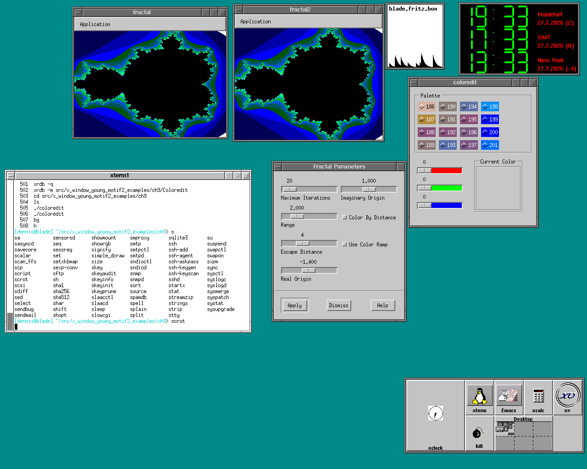
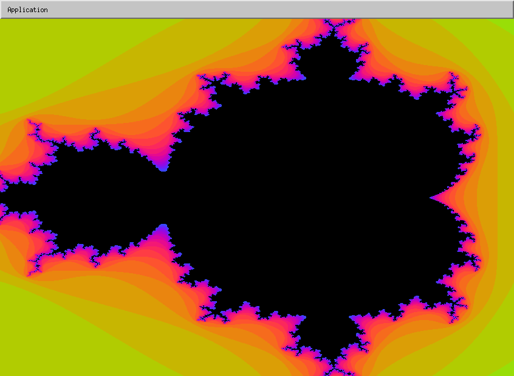
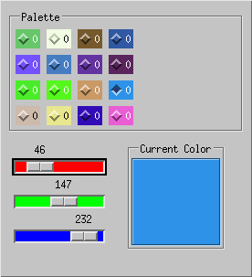

# X Window example code from Douglas Young's book from 1994
These directories contain the source to famous book "The X Window System:
Programming and Applications with Xt, Second Motif Edition", by
Douglas Young, Prentice Hall, 1994

Original README file: [README](README)

I went through all files and made minor changes to make the code compile and the examples work
on a nowadays Linux (2026, Opensuse Leap 15.6, gcc 15.2.0)

## Files with more that minor changes
coloredit and fractal2 were reworked to work on TrueColor displays too.

## Nice screendumps
ch9/coloredit and ch13/fractal + ch13/fractal2 running on OpenBSD 7.8 o a Sun Blade 100:



ch13/fractal2 running on OpenSuse Leap 16 in Truecolor. Algorithm for color selection is different then
in original code:


coloredit app OpenSuse Leap 16 in Truecolor:



coloredit app running on OpenBSD 7.8 o a Sun Blade 100:
See complete screendump above.

## Issues
None

## Solved issues
* ch17/Tree.c, changed API:
```c++
/*
* Move the widget into position.
*/
// _XmMoveObject is gone in 2.1, use XmeConfigureObject(), but API differs - needs analysis
_XmMoveObject ( w, tree_const->tree.x, tree_const->tree.y );
```

## Issue _XmMoveObject() function removed in Motif 2.x
Info on _Xm..() and Xme...() functions from https://linux.die.net/man/3/lesstifinternals:

```c++
When the LessTif project began some discussion was undertaken about the use of the 
previously undocumented internal _Xm.. functions in Motif 1.2. Apparently many of 
those functions have been transformed to Xme.. functions in OSF/Motif® 2.x and are 
also documented. As many people use these functions in their code (especially widget 
    writers) the implementation of the _Xm.. functions is important to the LessTif project.
```

For XmeConfigureObject() details, see here: https://archive.opengroup.org/openmotif/docs/m216.pdf

I think line:
```c++
_XmMoveObject ( w, tree_const->tree.x, tree_const->tree.y );
```

can be replaced with:
```c++
XtWidgetGeometry preferred;
XtQueryGeometry ( w, NULL, &preferred );

XmeConfigureObject(w, tree_const->tree.x, tree_const->tree.y,
       XtWidth(w), XtHeight(w), preferred.border_width );
```
XmeConfigureObject() is recommended over XtConfigureWidget(), because the Xme-function
also can handle Motif widgets and drop site information.

This was tested and result looks the same.

## Further reading
* Location of tar.Z file https://ftp.gwdg.de/pub/x11/x.org/R5contrib/young.motif2.tar.Z   